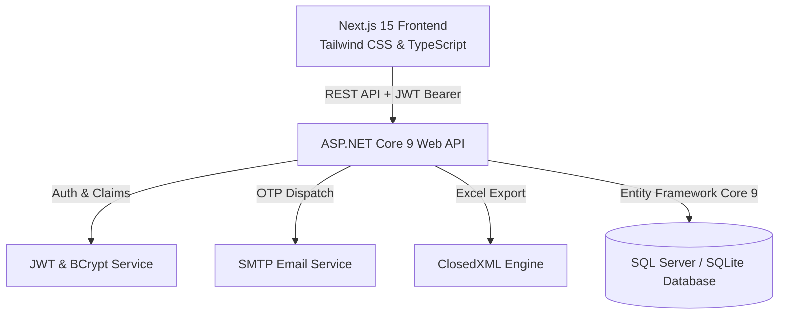

# 🏢 EAMS - Enterprise Attendance Management System

[](https://nextjs.org/)
[](https://dotnet.microsoft.com/)
[](https://learn.microsoft.com/en-us/ef/core/)
[](https://www.typescriptlang.org/)
[](https://docs.microsoft.com/en-us/dotnet/csharp/)
[](LICENSE)

**EAMS (Enterprise Attendance Management System)** is a modern, full-stack, enterprise-grade web application built with **Next.js (React 19, TypeScript)** and **ASP.NET Core 9 Web API (C#)**. It offers comprehensive role-based workflows for **Employees**, **Managers**, and **System Administrators**, supporting biometric-style attendance tracking, multi-tier leave approval pipelines, attendance corrections, OTP-based multi-factor authentication, customizable theme engines, notifications, and Excel reporting.

---

## 📑 Table of Contents

- [✨ Key Features](#-key-features)
- [🏛️ System Architecture](#️-system-architecture)
- [👥 Role-Based Workflows](#-role-based-workflows)
- [🛠️ Technology Stack](#️-technology-stack)
- [📂 Project Structure](#-project-structure)
- [🚀 Quick Start Guide](#-quick-start-guide)
  - [Prerequisites](#prerequisites)
  - [Backend Setup (.NET 9)](#backend-setup-net-9)
  - [Frontend Setup (Next.js)](#frontend-setup-nextjs)
- [🔑 Demo Accounts & Credentials](#-demo-accounts--credentials)
- [📡 API Endpoints Overview](#-api-endpoints-overview)
- [🎨 Theme Engine & Customization](#-theme-engine--customization)
- [📜 License](#-license)

---

## ✨ Key Features

### 🔐 Authentication & Security
- **Dual Authentication**: Password login (BCrypt hashed) and Passwordless 6-digit OTP verification via Email or Mobile.
- **JWT Bearer Token Security**: Role-based claims (`Admin`, `Manager`, `Employee`) with token validation and expiration management.
- **Route Guard & Authorization Policies**: Strict frontend and backend access control preventing unauthorized role escalation.

### 🕒 Attendance & Time Tracking
- **One-Click Check-In / Check-Out**: Real-time timer calculation, working hours, break tracking, and status calculation (Present, Late, Half-Day, Absent).
- **Interactive Calendar View**: Visual color-coded calendar highlighting daily work durations, overtime, and leave status.
- **Attendance Corrections**: Employees can submit correction requests with explanations for missed punches, subject to manager review.

### 🌴 Leave Management & Approval Engine
- **Multi-Type Leave Requests**: Casual, Sick, Paid, Maternity/Paternity, and Unpaid leave allocations with balance tracking.
- **Hierarchical Approval Pipeline**: Instant routing of leave applications to direct managers with real-time pending counters.
- **Manager Approval Modal**: Contextual approval/rejection with reviewer notes and instant employee notification.

### 📊 Reports & Excel Exports
- **Automated Spreadsheet Generation**: High-performance `.xlsx` generation using `ClosedXML` for date-range attendance, leave summaries, and audit logs.
- **Interactive Analytics**: Visual charts for departmental attendance rates, employee punctuality rankings, and overtime analysis.

### 🔔 Real-Time Notification Center
- **Two-Way Alerts**: Instant in-app notifications for submitted leaves, manager approvals/rejections, and system announcements.
- **Email Dispatching**: Integrated SMTP service for automated email alerts on critical workflow events.

### 🎨 Modern UI & Theme Customizer
- **Enterprise Design System**: Glassmorphism, smooth animations, and responsive layout across mobile, tablet, and desktop.
- **Dynamic Theme Engine**: Real-time palette switcher with persisted theme preferences (Dark, Light, Slate, Indigo, Emerald, Amber, Rose, etc.).

---

## 🏛️ System Architecture



---

## 👥 Role-Based Workflows

```
┌─────────────────────────────────────────────────────────────────────────┐
│                        ROLE CAPABILITIES MATRIX                         │
├───────────────────────┬──────────────┬──────────────────┬───────────────┤
│ Feature               │ Employee 👤  │ Manager 👔       │ Admin 🛡️      │
├───────────────────────┼──────────────┼──────────────────┼───────────────┤
│ Punch In / Out        │ ✅           │ ✅               │ ✅            │
│ View Personal History │ ✅           │ ✅               │ ✅            │
│ Apply for Leave       │ ✅           │ ✅               │ ✅            │
│ Request Correction    │ ✅           │ ✅               │ ✅            │
│ Approve Team Leaves   │ ❌           │ ✅ (Team Only)   │ ✅ (System)   │
│ Approve Corrections   │ ❌           │ ✅ (Team Only)   │ ✅ (System)   │
│ Team Performance KPI  │ ❌           │ ✅               │ ✅            │
│ Employee Management   │ ❌           │ ❌               │ ✅ (Full CRUD)│
│ Department Settings   │ ❌           │ ❌               │ ✅            │
│ Audit & System Logs   │ ❌           │ ❌               │ ✅            │
│ Excel Data Exports    │ ❌           │ ✅ (Team)        │ ✅ (Global)   │
└───────────────────────┴──────────────┴──────────────────┴───────────────┘
```

---

## 🛠️ Technology Stack

### Backend
- **Framework**: ASP.NET Core 9 (C#)
- **Data Access**: Entity Framework Core 9
- **Database**: Microsoft SQL Server / SQLite
- **Security**: JWT Bearer Authentication, BCrypt.Net
- **Office / Export**: ClosedXML
- **Documentation**: OpenAPI / Swagger

### Frontend
- **Framework**: Next.js 15 (App Router, Server & Client Components)
- **Library**: React 19
- **Language**: TypeScript
- **Styling**: Vanilla CSS Variables & Tailwind CSS Design System
- **Icons**: Lucide React

---

## 📂 Project Structure

```text
EAMS/
├── backend/
│   └── EAMS.Api/
│       ├── Authorization/         # Custom authorization policies & roles
│       ├── Controllers/           # REST API endpoints (Auth, Attendance, Leave, etc.)
│       ├── Data/                  # AppDbContext & EF configurations
│       ├── DTOs/                  # Data transfer objects & request contracts
│       ├── Migrations/            # EF Core database migrations
│       ├── Models/                # Domain models (Employee, Attendance, Leave, etc.)
│       ├── Services/              # Business logic (EmailService, OtpService)
│       ├── appsettings.json       # App configuration & connection strings
│       └── Program.cs             # Application bootstrap & middleware pipeline
├── frontend/
│   ├── src/
│   │   ├── app/
│   │   │   ├── admin/             # Administrator portal pages
│   │   │   ├── employee/          # Employee portal pages
│   │   │   ├── manager/           # Manager portal pages
│   │   │   ├── login/             # Dual mode login (Password / OTP)
│   │   │   ├── register/          # User registration portal
│   │   │   ├── globals.css        # Theme variables & global styles
│   │   │   └── layout.tsx         # Root layout with theme provider
│   │   ├── components/            # Reusable UI components & navigation shells
│   │   └── lib/                   # API client, auth utilities, theme context
│   ├── package.json
│   └── tsconfig.json
├── WORKFLOW_GUIDE.md              # Detailed workflow documentation
└── README.md                      # Project documentation
```

---

## 🚀 Quick Start Guide

### Prerequisites
- [.NET 9.0 SDK](https://dotnet.microsoft.com/download/dotnet/9.0)
- [Node.js (v18 or higher)](https://nodejs.org/) & `npm`
- [SQL Server](https://www.microsoft.com/en-us/sql-server/) (or SQLite local DB)

---

### Backend Setup (.NET 9)

1. **Navigate to backend directory**:
   ```bash
   cd backend/EAMS.Api
   ```

2. **Configure Database Connection**:
   Update `appsettings.json` with your SQL Server connection string (or use default LocalDB/SQLExpress):
   ```json
   "ConnectionStrings": {
     "DefaultConnection": "Server=localhost\\SQLEXPRESS;Database=EAMSDb;Trusted_Connection=True;TrustServerCertificate=True;"
   }
   ```

3. **Apply Database Migrations**:
   ```bash
   dotnet ef database update
   ```

4. **Run the API server**:
   ```bash
   dotnet run --launch-profile http
   ```
   > 🌐 Backend API will be available at: `http://localhost:5000` (Swagger at `http://localhost:5000/openapi/v1.json`)

---

### Frontend Setup (Next.js)

1. **Navigate to frontend directory**:
   ```bash
   cd frontend
   ```

2. **Install dependencies**:
   ```bash
   npm install
   ```

3. **Start development server**:
   ```bash
   npm run dev
   ```
   > 🌐 Frontend Application will be available at: `http://localhost:3000`

---

## 🔑 Demo Accounts & Credentials

| Role | Email | Password | Access Portal |
| :--- | :--- | :--- | :--- |
| 🛡️ **Admin** | `admin@eams.com` | `Admin123!` | `/admin` |
| 👔 **Manager** | `rahul@eams.com` | `Eams@123` | `/manager` |
| 👤 **Employee** | `om@example.com` | `Eams@123` | `/employee` |

*(Note: Quick one-click demo login buttons are also available directly on the login page for effortless evaluation.)*

---

## 📡 API Endpoints Overview

| Method | Endpoint | Description | Auth Required |
| :--- | :--- | :--- | :--- |
| `POST` | `/api/Auth/login` | Authenticate user with password & generate JWT | ❌ |
| `POST` | `/api/Auth/send-otp` | Request 6-digit OTP code to email/phone | ❌ |
| `POST` | `/api/Auth/login-otp` | Validate OTP & generate JWT session | ❌ |
| `GET` | `/api/Attendance/my` | Get attendance records for current employee | ✅ |
| `POST` | `/api/Attendance/check-in` | Record employee check-in timestamp | ✅ |
| `POST` | `/api/Attendance/check-out` | Record employee check-out timestamp | ✅ |
| `GET` | `/api/LeaveRequests` | Get leave requests (Role filtered) | ✅ |
| `POST` | `/api/LeaveRequests` | Submit new leave application | ✅ |
| `PUT` | `/api/LeaveRequests/{id}/approve` | Approve leave application | ✅ (Manager/Admin) |
| `PUT` | `/api/LeaveRequests/{id}/reject` | Reject leave application | ✅ (Manager/Admin) |
| `GET` | `/api/Export/attendance-excel` | Download ClosedXML attendance report | ✅ (Manager/Admin) |
| `GET` | `/api/Notifications/my` | Fetch real-time system & workflow alerts | ✅ |

---

## 🎨 Theme Engine & Customization

EAMS includes an advanced theme customization engine that updates CSS variables across the entire application in real-time.

- **Light Modes**: Standard Light, Crisp Pure White, Soft Sky
- **Dark Modes**: Midnight Obsidian, Charcoal Slate, Cyberpunk Navy
- **Vibrant Palettes**: Corporate Royal Blue, Emerald Green, Sunset Amber, Rosewood
- **Accessibility**: High-contrast indicators and responsive typography scaling

---

## 📜 License

Distributed under the **MIT License**. See `LICENSE` for more information.

---

<div align="center">
  <sub>Built with ❤️ by <a href="https://github.com/thecodergen">thecodergen</a></sub>
</div>
